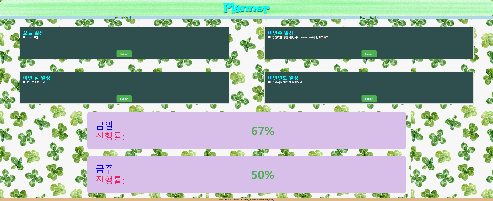
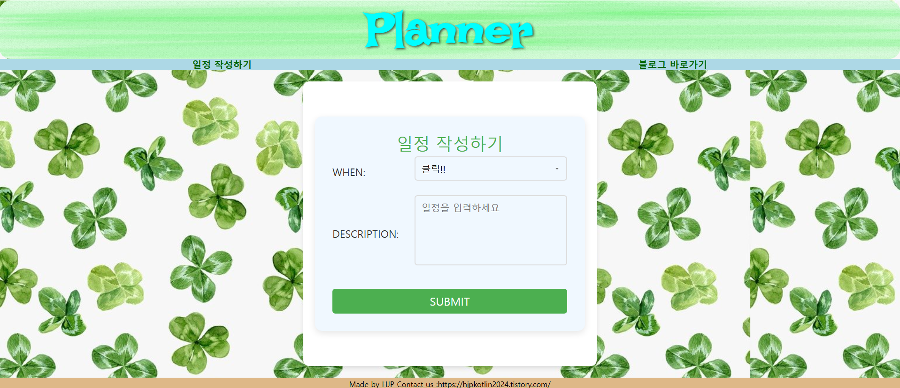

# Planner Application

이 프로젝트는 사용자가 일정을 추가하고, 진행률을 확인할 수 있는 **플래너 애플리케이션**입니다. 사용자는 하루, 주, 월 단위로 일정을 확인하고 관리할 수 있으며, 진행률을 확인할 수 있는 기능도 제공합니다.
해당 프로젝트는 어디까지나 개인프로젝트로써 백엔드와 프론트엔드를 연동해보고자 시작되었습니다.
따라서 회원가입,로그인 같은 기능은 구현하지 않았으며 총 2개의 페이지로 구성되어있습니다.

메인페이지

일정 작성하기 페이지

## 기능

1. **일정 작성하기**:
    - 사용자는 금일, 금주, 금월, 금년 단위로 일정을 작성할 수 있습니다.

2. **진행률 확인**:
    - 금일과 금주 진행률을 퍼센트로 표시하고, 진행 상황을 확인할 수 있습니다.

3. **일정 확인 및 업데이트**:
    - 사용자는 작성한 일정을 수행했다면 해당 일정을 실시간으로 업데이트할 수 있습니다.

4. **백엔드 API 연결**:
    - Spring Boot와 Kotlin을 기반으로 한 API가 연동되어 일정 작성, 조회, 진행률 확인 기능을 제공합니다.

## 프로젝트 구조

### **Backend** (Spring Boot + Kotlin + PostgreSQL)

- **API**:
    - `POST /todo` : 일정을 추가
    - `PATCH /planner/check/month_year`: 체크된 항목을 업데이트
    - `GET /planner/progress`: 금일/금주 진행률 조회

- **Database**: PostgreSQL을 사용하여 일정과 진행률 데이터를 저장합니다.

### **Frontend** (HTML, CSS, JavaScript)

- **Main Page**: 사용자가 금일, 금주, 금월 진행률을 확인할 수 있는 페이지
- **Create Todo Page**: 사용자가 일정을 작성할 수 있는 페이지
- **진행률 표시**: 금일 및 금주 진행률을 퍼센트로 표시

